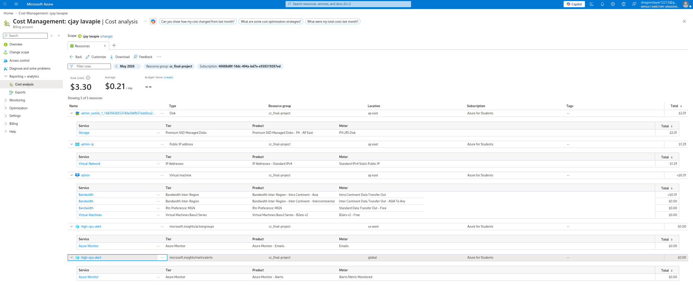

# Cost Operation

## Security & DevOps

### Advanced Security Controls
To enhance the overall security posture of the deployed application, advanced security measures were implemented within the Azure environment. Azure Web Application Firewall (WAF) was configured to help protect the application from common web vulnerabilities and malicious traffic. Additionally, Network Security Groups (NSGs) were applied to restrict unauthorized inbound and outbound traffic based on defined security rules. Managed Identities were also utilized to securely authenticate Azure services without exposing credentials in the application code.

**Portal Configuration Screenshot:**  
*(Insert screenshot here)*

---

### CI/CD Automation
Continuous Integration and Continuous Deployment (CI/CD) automation was implemented using GitHub Actions to streamline the deployment workflow. The pipeline automatically builds, tests, and deploys the application whenever updates are pushed to the repository. This reduces manual deployment effort, minimizes configuration errors, and ensures faster and more reliable software delivery.

**GitHub Actions / Deployment Pipeline Screenshot:**  
*(Insert screenshot here)*

---

# Monitoring & Operations

## Advanced Telemetry
Application Insights was integrated into the system to provide advanced telemetry and real-time monitoring capabilities. This service enables tracking of application performance, request rates, response times, failures, and user interactions. Logs and diagnostic data collected through Application Insights assist developers in identifying bottlenecks and improving system reliability.

**Application Insights Screenshot:**  
*(Insert screenshot here)*

---

## Alerting System
Azure Monitor Alerts were configured to proactively monitor system health and performance metrics. Custom alert rules were created based on selected metrics and log queries such as CPU utilization, failed requests, and application exceptions. Notifications are automatically triggered whenever thresholds are exceeded, enabling faster incident response and operational management.

**Azure Monitor Alerts Screenshot:**  
